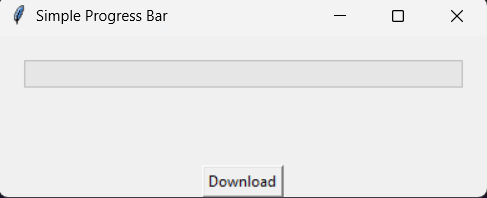

<h1 align="center">Hola 👋  soy Orlando / unsimpleDev ✨ </h1> 

<p align="center">
  <a href="https://img.shields.io/badge/License-MIT-blue.svg"></a>
</p>

This repository contains a Python script that uses the `tkinter` library to create a simple graphical user interface (GUI) simulating a file download process. The application includes a progress bar, dynamic percentage updates, and real-time status messages to visually represent the progress of the download.

---

## Table of Contents
- [Table of Contents](#table-of-contents)
- [Features](#features)
- [How It Works](#how-it-works)
- [Installations](#installations)
- [Usage](#usage)
- [License](#license)
- [Customization](#customization)
- [Contributions](#contributions)
- [Screenshots](#screenshots)

---

## Features

- **Progress Bar**: A horizontal progress bar (`ttk.Progressbar`) dynamically updates to reflect the download progress.
- **Dynamic Text Updates**:
  - Displays the current percentage (e.g., "20%").
  - Shows the download status (e.g., "2/10 GB complete").
- **Start Button**: A "Download" button initiates the simulation, demonstrating how to trigger functionality in a GUI.
- **Recursive Updates**: The progress is updated using recursion and `window.after()`, simulating a real-time download process with adjustable speed and size.

---

## How It Works

1. Click the "Download" button to start the simulation.
2. The progress bar increments based on predefined download size (`GB`) and speed (`speed`).
3. Labels update dynamically to show:
   - The percentage completed (e.g., "20%").
   - The current download status (e.g., "2/10 GB complete").
4. The simulation runs until the progress reaches 100%.

---

## Installations

1. Clone this repository:
   ```bash
   git clone https://www.github.com/Levelith/simple-progressbar-py
2. Navigate to the project directory:
   ```bash
   cd simple-progressbar-py

---

## Usage

1. Run the script using Python:
    ```bash
    python main.py

- Click the "download" button to start the simulation.
- Observe the progress bar and labels updating in real time.

---

## License

- This project is licensed under the **MIT License**, which allows you to use, modify, and distribute the code freely. Below is the full text of the license:
    ```text
    MIT License

    Copyright (c) 2025 Levelith

    Permission is hereby granted, free of charge, to any person obtaining a copy
    of this software and associated documentation files (the "Software"), to deal
    in the Software without restriction, including without limitation the rights
    to use, copy, modify, merge, publish, distribute, sublicense, and/or sell
    copies of the Software, and to permit persons to whom the Software is
    furnished to do so, subject to the following conditions:

    The above copyright notice and this permission notice shall be included in all
    copies or substantial portions of the Software.

    THE SOFTWARE IS PROVIDED "AS IS", WITHOUT WARRANTY OF ANY KIND, EXPRESS OR
    IMPLIED, INCLUDING BUT NOT LIMITED TO THE WARRANTIES OF MERCHANTABILITY,
    FITNESS FOR A PARTICULAR PURPOSE AND NONINFRINGEMENT. IN NO EVENT SHALL THE
    AUTHORS OR COPYRIGHT HOLDERS BE LIABLE FOR ANY CLAIM, DAMAGES OR OTHER
    LIABILITY, WHETHER IN AN ACTION OF CONTRACT, TORT OR OTHERWISE, ARISING FROM,
    OUT OF OR IN CONNECTION WITH THE SOFTWARE OR THE USE OR OTHER DEALINGS IN THE
    SOFTWARE.

For more details, see the [LICENSE](LICENSE) file.

---

## Customization

Feel free to use this code for your Tkinter project and modify it as you wish. I'll show you a simple way to modify the simulator.

- `GB`: Total download size (in GB). Default is `10`.
    ```python
    GB = 10 # Change to your desired total size.

- `speed`: Download speed (in GB per second). Default is `1`.
  
---

## Contributions

Constributions are welcome! I'm open to any code contributions you'd like to make to this simple little progress bar.

To contribute:

- Fork this repository.
- Create a new branch: `git checkout -b feature-name`.
- Commit your changes: `git commit -m "Add feature or fix"`.
- Push to the branch: `git push origin feature-name`.
- Open a pull request.

For any questions or suggestions, please open an issue.

---

## Screenshots


